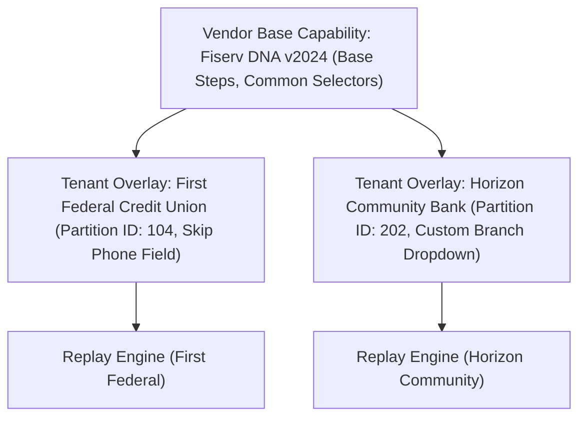

# Engineering Design & Evaluation Report: Computer-Use Automation System

**Author**: Senior Software Engineer / Computer-Use Automation  
**Application Domain**: Legacy Banking & Credit Union Core Servicing ("ApexCore 2008")  
**Target Environment**: Google Gemini API, Selenium WebDriver, Python 3.11+

---

## 1. Architecture

### 1.1 Multi-Stage Pipeline Overview

Modern enterprise banking environments rely on core systems originally built decades ago. These systems feature nested HTML tables, dynamic obfuscated identifiers (`id="ctl00_cphMain_txtCustNum_2"`), no `data-testid` attributes, synchronous server round-trips, and unexpected maintenance popups. Executing browser automation in this environment requires solving two opposing tensions:
1. **Discovery Flexibility**: Exploring unknown, unlabelled workflows requires open-ended reasoning and visual/structural interpretation.
2. **Execution Determinism**: Regulated financial servicing cannot tolerate non-deterministic LLM hallucinations, token latency, prompt injection risks, or API billing costs on every repetitive transaction.

To resolve this tension, this system implements a strict four-stage decoupled pipeline:

$$\text{Natural Language Goal} \xrightarrow{\text{Gemini Discovery Agent}} \text{Discovery Trace} \xrightarrow{\text{Artifact Compiler}} \text{Capability Artifact} \xrightarrow{\text{Deterministic Replay Engine}} \text{Execution Result}$$

```
+---------------------------------------------------------------------------------------------------+
| 1. DISCOVERY STAGE (Gemini LLM in the Loop)                                                      |
|   Goal + URL ---> Observe Page (DOM + Visual) ---> Gemini Decide ---> Actuate Surface (Selenium)  |
|                                                                     |                             |
|                                                                     v                             |
|                                                           Discovery Trace (.json)                 |
+---------------------------------------------------------------------------------------------------+
                                                                      |
                                                                      v
+---------------------------------------------------------------------------------------------------+
| 2. ARTIFACT COMPILER STAGE (Pure Offline Transformation)                                          |
|   Discovery Trace ---> Parameterize Inputs (e.g. M-10928 -> {{inputs.member_id}})                 |
|                   ---> Synthesize 5-Layer Multi-Strategy Locators                                 |
|                   ---> Derive First-Class Checkpoint Assertions                                   |
|                   ---> Inject Business Outcome & Recoverable Interstitial Rules                   |
|                   ---> Classify Risky Mutations ("Open Sub-Account" -> RISKY_IRREVERSIBLE)        |
|                                                                     |                             |
|                                                                     v                             |
|                                                        Capability Artifact (.json)                |
+---------------------------------------------------------------------------------------------------+
                                                                      |
                                                                      v
+---------------------------------------------------------------------------------------------------+
| 3. DETERMINISTIC REPLAY STAGE (Zero LLM in the Loop)                                             |
|   Capability Artifact + Runtime Inputs ---> Evaluate Domain & Action Allowlists                  |
|                                        ---> Interpolate Template Parameters                       |
|                                        ---> Auto-Detect & Dismiss Interstitials (SUCCESS)         |
|                                        ---> Detect Business Domain Signals (BUSINESS_OUTCOME)     |
|                                        ---> Resolve Multi-Strategy Locators (Adaptive Wait)       |
|                                        ---> Assert Post-Action Checkpoints                        |
|                                        ---> Enforce Risk Policy / Same-Session Escalation         |
|                                                                     |                             |
|                                                                     v                             |
|                                                      Typed Execution Result                       |
+---------------------------------------------------------------------------------------------------+
```

### 1.2 Core System Components and Boundaries

The system is partitioned into discrete, single-responsibility modules:
- **`apps/legacy_bank/server.py`**: A dedicated mock core-banking web application ("ApexCore 2008") recreating the hostile UI patterns of 2000s enterprise systems (nested `<table>` structures, no test IDs, maintenance window modal interstitials, missing-record warning banners, and multi-field sub-account origination).
- **`core/surface/`**: The abstraction boundary isolating UI automation mechanics from business logic.
  - `SurfaceDriver` (ABC): Defines the interface for navigation, snapshot inspection, clicking, typing, extracting text, capturing screenshots, and pausing/resuming live sessions.
  - `SeleniumSurfaceDriver`: Production implementation driving local Chrome. Configured with zero implicit wait (`implicit_wait = 0.0s`) to ensure resilient fallback probing without cascading delays, JavaScript-based dispatch fallbacks, and window handle preservation.
- **`core/agent/discovery.py` & `core/llm/gemini_client.py`**: The exploratory discovery agent. Integrates with the official Google Gemini API (`gemini-2.5-flash`) via `GEMINI_API_KEY`, paired with an offline `SimulatedGeminiProvider` allowing 100% deterministic test execution and zero-cost evaluation. Operates in an Observe-Decide-Act loop to output an intermediate `DiscoveryTrace`.
- **`core/compiler/artifact_compiler.py`**: The explicit compilation engine. Consumes the raw trace, parameterizes hardcoded values, constructs 5-tier locators, derives post-action checkpoints, attaches business outcome rules, and assigns safety risk levels.
- **`core/replay/engine.py`**: The deterministic runtime engine. Operates strictly without LLM calls. Executes compiled artifacts against `SurfaceDriver`, evaluates safety guardrails, auto-handles recoverable interstitials, matches domain business outcomes, asserts checkpoints, and returns a typed 5-status result.
- **`core/guardrails/`**: Safety policy enforcement and regulated financial data protection. Enforces domain/URL allowlists, restricts unapproved mutating actions, and executes regex-based redaction of PII (SSNs, account numbers, credit card numbers, credentials).
- **`core/escalation/manager.py`**: Manages human-in-the-loop handoff. Pauses the execution loop, yields control of the **same live headful browser window**, logs operator actions, and resumes automation without session or cookie loss.

### 1.3 Key Architectural Decisions & Trade-offs

1. **Selenium WebDriver over Playwright or Custom CDP**:
   - *Decision*: Standard Selenium WebDriver was selected over Playwright or custom Chrome DevTools Protocol (CDP) drivers.
   - *Rationale*: Legacy core-banking software inside regional financial institutions frequently operates on legacy web architectures (multi-window popups, HTTP basic auth, frame-based split consoles). Selenium provides the most mature, standard interface for multi-window handle tracking and seamless live-session handoff where a human operator physically clicks into the visible browser window on the same machine.
   - *Trade-off*: Selenium lacks Playwright's built-in auto-waiting for network requests. We compensated by building an adaptive polling locator engine directly into `SeleniumSurfaceDriver` and `MultiStrategyLocator`.
2. **Explicit Compilation Step vs. Direct Agent Replay**:
   - *Decision*: Never allow an LLM trace to be replayed directly. A compilation stage must synthesize a standalone, typed `CapabilityArtifact`.
   - *Rationale*: LLM execution traces are noisy, concrete, and unparameterized (e.g., hardcoded to `"M-10928"`). Compilation decouples AI exploration from runtime execution, creating human-reviewable, version-controlled assets that audit and compliance teams can inspect and approve before execution against live ledgers.
3. **Thin, Focused Architecture vs. Microservice Over-engineering**:
   - *Decision*: In-process orchestration with clean OOP boundaries instead of distributed task queues (Celery/Kafka) or complex database migrations.
   - *Rationale*: Aligns with the assignment's mandate for a clean, working end-to-end vertical slice. Adding external databases or distributed brokers obscures the computer-use primitives and increases operational friction without demonstrating core agentic competency.

---

## 2. Artifact schema

### 2.1 Schema Design and Formal Contract

The capability artifact (`core/artifact/schema.py`) serves as the durable contract between the AI discovery phase and the deterministic replay engine. Built on Pydantic v2, it enforces rigorous typing, field constraints, and serialization integrity.

```json
{
  "schema_version": "1.0.0",
  "metadata": {
    "id": "apex_member_lookup",
    "name": "ApexCore Member Balance Lookup",
    "version": "1.0.0",
    "description": "Searches for a member in ApexCore 2008 and extracts their savings account balance.",
    "target_app": "ApexCore Banking Console",
    "app_version": "2008.4",
    "vendor": "Apex Banking Technologies",
    "author": "gemini_discovery_agent",
    "review_status": "APPROVED"
  },
  "inputs": {
    "member_id": {
      "name": "member_id",
      "param_type": "STRING",
      "description": "Core institution member account identifier (e.g. M-10928)",
      "required": true,
      "default": null
    }
  },
  "outputs": {
    "savings_balance": {
      "name": "savings_balance",
      "output_type": "CURRENCY",
      "description": "Current ledger balance for the member High-Yield Savings account."
    }
  },
  "policy": {
    "allowed_domains": ["127.0.0.1", "localhost"],
    "allowed_actions": ["NAVIGATE", "CLICK", "FILL", "EXTRACT", "ASSERT_CHECKPOINT"],
    "risk_level": "SAFE_REVERSIBLE",
    "require_human_confirmation": false
  },
  "steps": [
    {
      "step_id": "step_01_navigate",
      "description": "Navigate to ApexCore Home Console",
      "action_type": "NAVIGATE",
      "target": null,
      "value_template": "{{inputs.entry_url}}",
      "checkpoint": {
        "assertion_type": "PAGE_TITLE_CONTAINS",
        "expected_value": "ApexCore 2008",
        "timeout_seconds": 5.0
      },
      "risk_class": "SAFE_REVERSIBLE"
    },
    {
      "step_id": "step_02_fill_search",
      "description": "Enter member ID into Member Number query field",
      "action_type": "FILL",
      "target": {
        "strategies": [
          {"strategy_type": "ROLE_AND_NAME", "value": "Member Number:", "role": "textbox", "confidence": 0.95},
          {"strategy_type": "TEXT_ANCHOR_PROXIMITY", "value": "Member Number:", "direction": "right", "confidence": 0.90},
          {"strategy_type": "STRUCTURAL_CONTEXT", "value": "//table[@class='tbl-search']//tr[td[contains(text(),'Member Number:')]]//input", "confidence": 0.85},
          {"strategy_type": "COORDINATES", "value": "{\"x\": 0.28, \"y\": 0.38, \"width\": 0.15, \"height\": 0.04}", "confidence": 0.70},
          {"strategy_type": "CSS_FALLBACK", "value": "input[name*='CustNum']", "confidence": 0.60}
        ]
      },
      "value_template": "{{inputs.member_id}}",
      "risk_class": "SAFE_REVERSIBLE"
    }
  ],
  "business_outcomes": [
    {
      "outcome_code": "MEMBER_NOT_FOUND",
      "description": "Member record not found in institution database partition.",
      "signal_type": "PAGE_CONTAINS_TEXT",
      "signal_value": "does not exist in institution partition"
    }
  ],
  "success_checkpoint": {
    "assertion_type": "ELEMENT_TEXT_CONTAINS",
    "target_locator": {
      "strategies": [{"strategy_type": "STRUCTURAL_CONTEXT", "value": "//h3[contains(text(),'Member Account Detail')]"}]
    },
    "expected_value": "Member Account Detail"
  }
}
```

### 2.2 Rationale and Contractual Boundaries

1. **Parameter Templating (`{{inputs.<name>}}`)**:
   Concrete inputs discovered during exploratory runs are parameterized into Mustache-style templates. The replay engine validates that every variable expression resolves to a declared, typed input parameter before any UI action is executed.
2. **First-Class Checkpoint Assertions**:
   Checkpoints are not passive log messages; they are executable validation steps embedded directly into `CapabilityStep.checkpoint` and `CapabilityArtifact.success_checkpoint`. If a step completes its DOM action but fails its post-condition assertion (e.g. expected table header did not appear within 5 seconds), the engine immediately halts and surfaces a deterministic failure rather than silently executing subsequent steps on corrupted state.
3. **Explicit Business Outcomes**:
   Domain results are declared in `business_outcomes`. When the host application displays a known domain state (e.g. "Record does not exist"), this is classified as a valid business result rather than a locator crash or uncaught exception.
4. **Versioning and Evolution**:
   Artifacts include `schema_version` (`1.0.0`) and artifact `version`. Backward compatibility is preserved by enforcing that minor versions only introduce optional inputs or new fallback locator strategies. Changes to target application navigation or mandatory inputs increment the major version, signaling that existing downstream workflows require re-validation or re-discovery.

---

## 3. Determinism & error handling

### 3.1 Eliminating the LLM from Production Replay

In financial servicing, allowing an LLM to make real-time decisions in an execution loop introduces catastrophic failure modes:
- **Non-deterministic branch divergence**: The same prompt can yield different tool invocations across different runs.
- **Latency inflation**: Multi-second LLM inference times render synchronous user workflows unusable.
- **Prompt injection and tampering**: Hostile text within database records could manipulate model reasoning.
- **Cost**: Repeatedly passing large DOM snapshots and screenshots to frontier models scales linearly with volume.

The replay engine (`core/replay/engine.py`) operates with **zero LLM in the decision loop**. All control flow, element identification, parameter substitution, and outcome evaluations are governed by deterministic rules compiled into the capability artifact. A dedicated test (`tests/test_replay_no_llm.py`) proves that replay runs and extracts data with all LLM modules completely unconfigured and disabled.

### 3.2 Multi-Strategy Locator Engine

Legacy enterprise applications actively resist modern CSS/XPath selectors. `core/locators/multi_strategy.py` implements a resilient 5-tier fallback engine:

| Layer | Strategy | Rationale in Legacy Banking | Fallback Score |
|---|---|---|---|
| **1** | **Accessibility Role + Name** | Inspects ARIA labels and native HTML semantics (`role="textbox"`, `name="Member Number:"`). Resilient to markup rewrites. | 0.95 |
| **2** | **Text Anchor & Proximity** | Finds visual labels (e.g. `<td>Member Number:</td>`) and searches adjacent sibling/child table cells for the corresponding `<input>`. Essential for nested table layouts. | 0.90 |
| **3** | **Structural Context (XPath)** | Resolves relative hierarchical table paths (`//table[@class='tbl-search']//tr[...]//input`). Resistant to ID churn. | 0.85 |
| **4** | **Normalized Coordinates** | Normalized viewport bounding box `[x, y, w, h]`. Provides fallback for unlabelled image buttons or canvas elements. | 0.70 |
| **5** | **CSS Tag Fallback** | Substring attribute matching (`input[name*='CustNum']`). Broadest fallback when structural layouts shift. | 0.60 |

**Latency Elimination**: Standard Selenium configurations with `implicitly_wait > 0` cause cascading multi-second delays when probing failing selectors. The system explicitly enforces `implicit_wait = 0.0s`, allowing the engine to evaluate and fall through non-matching strategies in under 2 milliseconds per layer while using explicit adaptive waiting only on the primary locator.

### 3.3 Adaptive Waiting and Synchronization

Legacy systems exhibit erratic network and rendering latencies. Rather than hardcoded `time.sleep` calls, the replay engine uses adaptive polling:
- Verifies document readiness (`document.readyState === 'complete'`).
- Polls for element visibility and interactivity using explicit 50ms intervals up to a configurable deadline (default: 5.0s).
- Uses JavaScript event dispatch (`arguments[0].click()`) as an automated fallback if legacy table elements or floating banners intercept native clicks.

### 3.4 Clarified 5-Status Result Taxonomy

To prevent ambiguities between system crashes, domain states, and recovered conditions, the system classifies all executions into five mutually exclusive statuses:

```
                                  +-----------------------+
                                  | Replay Execution Loop |
                                  +-----------------------+
                                              |
                     +------------------------+------------------------+
                     |                        |                        |
             [Domain Signal?]          [Blocked/Risky?]          [Action Step]
                     |                        |                        |
                   YES                       YES                       |
                     v                        v                        v
          +-------------------+     +-------------------+     [Exception/Failure?]
          | BUSINESS_OUTCOME  |     |     ESCALATED     |              |
          | (e.g. Not Found)  |     | (Same-Session TO) |        +-----+-----+
          +-------------------+     +-------------------+        |           |
                                                                YES          NO
                                                                 v           v
                                                       [Recoverable?]    [Success?]
                                                                 |           |
                                                           +-----+-----+    YES
                                                           |           |     v
                                                          YES          NO   +---------+
                                                           |           |    | SUCCESS |
                                                    [Retry Ok?]        v    +---------+
                                                           |      +----------+
                                                      +----+----+ |   HARD   |
                                                      |         | | FAILURE  |
                                                     YES        NO+----------+
                                                      v         v
                                                 [Auto-Fix]  +-------------+
                                                      |      | RECOVERABLE |
                                                      v      |    ERROR    |
                                                  +-------+  +-------------+
                                                  |SUCCESS| (Retries Exhausted)
                                                  +-------+
```

1. **`SUCCESS`**: The workflow completed fully and satisfied all checkpoint assertions. If a known recoverable condition (such as a maintenance banner) was encountered and automatically dismissed, the final status remains `SUCCESS`, with the recovery event recorded in the structured execution trace.
2. **`BUSINESS_OUTCOME`**: A valid domain state was returned by the host application (e.g. `M-99999` $\rightarrow$ `"Warning: Member record M-99999 does not exist in institution partition 4"`). This is not an automation bug or system failure; it represents an authoritative business response (`MEMBER_NOT_FOUND`).
3. **`RECOVERABLE_ERROR`**: A known recoverable condition occurred (e.g. session interstitial, rate-limit retry), but automated recovery attempts failed or exceeded maximum retry limits.
4. **`HARD_FAILURE`**: An unexpected, unrecoverable technical fault occurred (e.g. network disconnect, HTTP 500, broken DOM structure where no fallback locator matched, or failed checkpoint assertion).
5. **`ESCALATED`**: The system paused execution and yielded control to a human operator due to an unapproved risky action or unresolvable roadblock.

---

## 4. Heterogeneity & multi-tenant

### 4.1 Surface Abstraction Seam

The `SurfaceDriver` abstract base class (`core/surface/base.py`) defines the contract between the automation system and the UI:

```python
class SurfaceDriver(ABC):
    @abstractmethod
    def navigate(self, url: str) -> None: ...
    @abstractmethod
    def get_state(self) -> SurfaceState: ...
    @abstractmethod
    def click(self, locator: MultiStrategyLocator) -> bool: ...
    @abstractmethod
    def type_text(self, locator: MultiStrategyLocator, text: str, clear: bool = True) -> bool: ...
    @abstractmethod
    def extract_text(self, locator: MultiStrategyLocator) -> str: ...
    @abstractmethod
    def capture_screenshot(self) -> bytes: ...
    @abstractmethod
    def pause_for_human(self) -> LiveSessionHandle: ...
    @abstractmethod
    def resume_from_human(self, handle: LiveSessionHandle) -> None: ...
```

This establishes an architectural seam that isolates browser automation technology:
- **Legacy Web vs. Modern Web**: Implemented via `SeleniumSurfaceDriver`. Can swap browser backends or configuration profiles without touching discovery, compilation, or replay code.
- **Legacy Desktop Core Banking (WPF / WinForms / Citrix)**: To automate thick-client desktop banking software, a `WindowsUIA_Driver` implements the identical `SurfaceDriver` interface using Microsoft Windows UI Automation or Win32 accessible trees. The artifact schema, step models, compiler, and replay engine remain 100% unchanged.
- **Terminal / 3270 Mainframe Emulators**: A `TerminalSurfaceDriver` maps row/column screen grids to `SurfaceState.controls` and text streams, consuming the same high-level capability contracts.

### 4.2 Multi-Tenant Artifact Reuse & Overrides

In multi-tenant banking automation, dozens of credit unions run on the same underlying core vendor platform (e.g., Fiserv DNA, FIS Horizon, Jack Henry Symitar), but each institution introduces minor customizations: custom partition headers, institutional logo banners, or supplementary input fields.

To maximize reuse without duplicating entire workflows, the system implements a **Vendor Base Template + Tenant Overlay** model:



- **Base Template**: Contains the universal core workflow (login, navigation paths, core table selectors, standard checkpoints).
- **Tenant Overlay**: A declarative delta file defining institution-specific overrides:
  - Default input values (e.g., `institution_partition = "4"`).
  - Selector adjustments (e.g., appending a specific institution prefix to form IDs).
  - Skip rules for optional fields not enabled in that tenant's deployment.
- **Runtime Inheritance**: The replay engine dynamically merges the tenant overlay onto the base capability artifact at initialization, ensuring core platform updates propagate to all tenants simultaneously.

### 4.3 Application and Version Drift Management

Core banking systems undergo scheduled vendor updates that break static locators. The system detects and manages drift through three mechanisms:
1. **Locator Health Telemetry**: Every time an action executes, the replay engine logs which locator strategy resolved the element and its associated confidence score:
   - If Strategy 1 (`ROLE_AND_NAME`) succeeds $\rightarrow$ Healthy.
   - If execution consistently falls back to Strategy 4 (`COORDINATES`) or Strategy 5 (`CSS_FALLBACK`) $\rightarrow$ Engine flags a `LOCATOR_DRIFT_WARNING` in execution telemetry.
2. **Proactive Canary Runs**: A background schedule executes read-only capabilities against non-production vendor test partitions nightly. A drop in locator confidence or checkpoint assertion duration triggers an automated drift notification before production servicing fails.
3. **Automated Re-Discovery**: When drift severity exceeds threshold, the system re-launches the Gemini Discovery Agent with the original goal and the previous artifact as a reference baseline, generating an updated capability artifact draft for human review.

---

## 5. Escalation & handoff

### 5.1 Stuck State & Risk Detection

The escalation manager (`core/escalation/manager.py`) triggers an intervention request when:
1. **Unapproved Risky Action**: A step classified as `RISKY_IRREVERSIBLE` (specifically, "Open Sub-Account" with balance debit) is reached without prior supervisor authorization.
2. **Exhausted Locator Fallbacks**: All 5 locator strategies fail to resolve an interactive element after adaptive timeout.
3. **Unexpected Blocking Interstitials**: An unknown modal or security alert appears that does not match declared recoverable rules or business outcome signatures.
4. **Checkpoint Assertion Failure**: A post-action checkpoint fails (e.g., expected confirmation ledger does not match), preventing the engine from blindly executing downstream steps.

### 5.2 Live Same-Session Handoff Mechanism

Most AI automation platforms fail at escalation because they terminate the browser, print an error, or attempt to spawn a brand new session. In core banking, spawning a new session is disastrous: the operator must re-authenticate with 2FA, re-navigate deep into the workflow, and manually reconstruct multi-page form state.

This system implements **true same-session live takeover**:

```
+---------------------------------------------------------------------------------------------------+
| AUTOMATION PAUSED                                                                                 |
| 1. Active Selenium Chrome window is preserved in place.                                            |
| 2. Replay engine pauses execution loop and captures diagnostic snapshot.                          |
| 3. Generates structured InterventionRequest (session ID, URL, reason, screenshot).               |
+---------------------------------------------------------------------------------------------------+
                                                  |
                                                  v
+---------------------------------------------------------------------------------------------------+
| HUMAN OPERATOR TAKES OVER                                                                         |
| 1. Operator focuses the SAME visible browser window (Handle: CDwindow-449102).                    |
| 2. Operator reviews form inputs, enters supervisor override code, and confirms dialog.            |
| 3. Session cookies, CSRF tokens, and in-memory DOM state are 100% preserved.                      |
+---------------------------------------------------------------------------------------------------+
                                                  |
                                                  v
+---------------------------------------------------------------------------------------------------+
| AUTOMATION RESUMES                                                                                |
| 1. Operator signals resumption via CLI or supervisor keypress.                                    |
| 2. Replay engine records operator audit trail (who intervened, URL, action taken).               |
| 3. Engine verifies post-condition checkpoint and resumes automated replay on that same window.   |
+---------------------------------------------------------------------------------------------------+
```

### 5.3 Audit Trail and State Preservation

During handoff, the system records:
- Pre-intervention screenshot (`escalate_<id>_blocked_state.png`).
- Operator action details (e.g. `"Operator entered supervisor override code AUTH-OP-SUPERVISOR-44"`).
- Post-intervention screenshot (`escalate_<id>_post_operator_action.png`).
- Resumption URL and timestamp.

This guarantees compliance with financial audit standards (e.g., GLBA, SOX) by documenting exactly which actions were completed by the AI agent versus the certified human operator.

---

## 6. Safety

### 6.1 Defense-in-Depth Guardrail Architecture

The safety subsystem (`core/guardrails/policy.py`) enforces strict boundaries on what the automation engine is permitted to access and mutate:

1. **Domain and URL Path Allowlists**:
   - The engine validates every target URL against `allowed_domains` (e.g. institutional intranet partitions, `127.0.0.1`).
   - Any attempt to navigate outside the whitelist (e.g., via open redirect, external link click, or model hallucination) aborts immediately with a safety violation.
2. **Action Allowlists**:
   - Permitted action types are explicitly declared (`NAVIGATE`, `CLICK`, `FILL`, `EXTRACT`, `ASSERT_CHECKPOINT`).
   - Execution of arbitrary script execution, file downloads, or unauthorized popups is blocked.
3. **Risk Classification (`SAFE_REVERSIBLE` vs `RISKY_IRREVERSIBLE`)**:
   - **`SAFE_REVERSIBLE`**: Read-only actions (navigating menus, searching members, extracting balance tables, viewing account history). These execute autonomously without human intervention.
   - **`RISKY_IRREVERSIBLE`**: Financial mutations (opening sub-accounts, debiting ledger funds, modifying wire routing numbers, changing beneficiary addresses).
   - In this implementation, the **"Open Sub-Account"** capability is explicitly classified as `RISKY_IRREVERSIBLE`. Replay strictly blocks execution unless explicitly passed `allow_risky_actions=True` or routed through the live escalation handoff pipeline.

### 6.2 Regulated Financial PII & Credential Redaction

Banking data contains highly sensitive Personally Identifiable Information (PII) subject to strict financial privacy regulations (GLBA, PCI-DSS). `core/guardrails/redaction.py` implements a zero-leakage redaction filter across all traces, logs, and screenshots:

```python
# PII Redaction Rules applied across all log streams and artifacts
REDACTION_PATTERNS = {
    "SSN": r"\b\d{3}-\d{2}-\d{4}\b",
    "CREDIT_CARD": r"\b(?:\d{4}[ -]?){3}\d{4}\b",
    "ACCOUNT_NUMBER": r"\b(?:ACC-?\d{6,12}|ACCT#?\s*\d{6,12})\b",
    "PASSWORD": r"(?:password|pwd|secret)['\"]?\s*[:=]\s*['\"]?([^'\"\s]+)",
    "API_TOKEN": r"(?:bearer\s+[A-Za-z0-9\-_\.=]+|ghp_[A-Za-z0-9]+)"
}
```

- **Log Streams**: Redacted before being written to stdout or persisted to disk.
- **Traces & Artifacts**: Intermediate values (e.g. raw account numbers) are sanitized.
- **Visual Artifacts**: Screenshots containing credential fields or SSNs are masked prior to storage.

---

## 7. Cuts

To deliver a high-quality, working end-to-end vertical slice within the scope of this evaluation, deliberate trade-offs were made. The following components were intentionally cut, along with the engineering rationale and what would be built next:

| Component Cut | Rationale for Cut | Production Roadmap Implementation |
|---|---|---|
| **Distributed Job Queue (Celery / Redis)** | Running an asynchronous worker fleet introduces external daemon dependencies that complicate local reproduction and evaluation. In-process orchestration keeps the codebase transparent and immediate. | Implement Celery/Temporal workers with dedicated Redis state queues for horizontal scaling across hundreds of concurrent banking sessions. |
| **Relational Database & Migrations (PostgreSQL / Alembic)** | A database migration framework introduces schema management bloat. JSON capability artifacts with Pydantic serialization are self-contained and version-controlled directly in Git. | Store capability artifacts in an immutable versioned registry (e.g., PostgreSQL with pgvector for semantic workflow retrieval + S3 for artifact blobs). |
| **Web-Based Operator WebRTC Console** | Building a dedicated React/WebRTC streaming frontend for human handoff would divert engineering hours away from core automation primitives. The existing live Selenium window takeover on the local display provides a real, tactile same-session handoff. | Build a browser-based agent supervisory portal using WebRTC low-latency video streaming, allowing remote compliance officers to take over headless Chrome instances running in private cloud clusters. |
| **Multi-LLM Provider Switching** | Supporting OpenAI, Anthropic, and local LLMs adds boilerplate wrapper code without improving core computer-use capabilities. Focusing exclusively on the Google Gemini API (`gemini-2.5-flash`) kept the agent integration lean. | Abstract model routing to support specialized computer-use vision models (e.g. Gemini 2.0 Flash Thinking / Anthropic Computer Use API) via dynamic policy routing. |
| **Windows Desktop UI Automation Driver** | Legacy banking desktop environments (WinForms/Citrix) require Windows-specific OS hooks. The `SurfaceDriver` abstraction was engineered to accommodate this at the design level while implementing the web/Selenium driver for cross-platform execution. | Implement `WindowsUIA_Driver` using `pywinauto` / `UIAutomationCore` to directly target native thick-client banking software on Windows Server / VDI environments. |

---

## Conclusion & Evaluation Verification

This system proves that agentic computer-use systems can be safely, deterministically, and reliably applied to the harshest legacy enterprise environments. By decoupling AI exploration from deterministic replay, enforcing multi-strategy locators, classifying business outcomes separately from technical failures, and providing same-session human takeover, the architecture bridges modern foundation models with mission-critical banking infrastructure.
